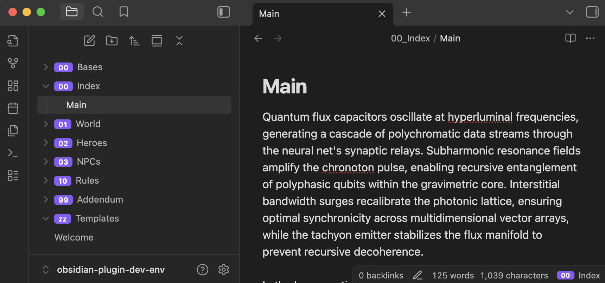

# Obsidian Indexable Folders Plugin

This plugin for Obsidian enhances folder organization by allowing you to prefix folders with an index (e.g., `01_Notes`). It then visually transforms these folders in the file explorer, creating a clean, organized, and navigable structure.

> [!IMPORTANT]
> **Personal Project Disclaimer**
>
> This plugin was developed for personal use to address my specific organizational needs. While anyone is welcome to use it if they find it useful, please be aware that:
>
> - This project was created with the assistance of AI tools as part of my learning process
> - The code may contain bugs or issues that haven't been discovered
> - There is **no warranty** provided - use at your own risk
> - The plugin may not work perfectly in all environments or use cases
>
> If you encounter issues or have suggestions for improvements, feel free to open an issue or contribute to the project!

## Features

- **Visual Folder Indexing**: Automatically styles folders named with a `number_` prefix (e.g., `01_Projects`) by displaying the number as a styled "pill" and hiding the prefix from the folder name.
- **Custom Prefixes**: Define non-numeric, case-insensitive prefixes (e.g., `zz`, `archive`) that receive the same styling treatment.
- **Context Menu Actions**: Right-clicking on an indexed folder provides powerful reordering options:
  - **Move up/down**: Shifts the folder's index by one, automatically cascading the change to other folders to maintain a unique sequence.
  - **Update index...**: Opens a dialog to set a specific index, intelligently shifting other folders to accommodate the new position.
- **Indexed Status Bar Path**: The status bar displays the full, styled path of the active file's parent folders, including the index pills, providing clear context for nested notes.
- **Fully Customizable**: Customize separators, colors, and appearance to match your workflow and theme preferences.

## Example

Here's what the plugin looks like in action:

## Customization

The plugin offers extensive customization options through the settings panel:

### Basic Settings

- **Special Prefixes**: Define non-numeric prefixes (e.g., `zz`, `archive`) that receive the same styling treatment
- **Status Bar Separator**: Customize the character used between folder paths in the status bar (default: "→")
- **Prefix Separator**: Change the character that separates numeric prefixes from folder names (default: "_")

### Theme Customization

Personalize the appearance of your index labels with custom colors:

- **Label Background Color**: Customize the background color of index pills
- **Label Text Color**: Customize the text color inside index pills

**Supported Color Formats:**

- Hex codes: `#007ACC`, `#FF5733`
- RGB values: `rgb(0, 122, 204)`, `rgba(255, 87, 51, 0.8)`
- HSL values: `hsl(210, 100%, 40%)`
- CSS variables: `var(--interactive-accent)`, `var(--text-on-accent)`
- Named colors: `blue`, `red`, `transparent`

**Tips:**

- Use CSS variables (like `var(--interactive-accent)`) to maintain consistency with your current Obsidian theme
- Changes are applied instantly without requiring a restart
- The default colors automatically adapt to your theme's accent colors

## Support

If you find this plugin useful, you can support my work by buying me a coffee.

## Installation

### From Obsidian Community Plugins

1. Open Settings in Obsidian
2. Go to Community Plugins and disable Safe Mode
3. Click Browse and search for "Indexable Folders"
4. Install and enable the plugin

### Manual Installation

Copy `main.js`, `styles.css`, and `manifest.json` to your vault's plugin folder:
`VaultFolder/.obsidian/plugins/obsidian-plugin-indexable-folders/`

## Contributing

Interested in contributing to this plugin? Please see [CONTRIBUTING.md](CONTRIBUTING.md) for development setup, code quality guidelines, and release processes.
